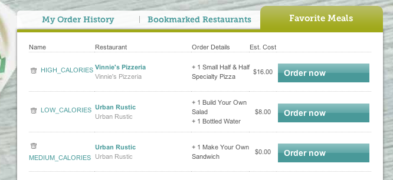

```
           .-""""-.
          /' .  '. \
         (`-..:...-')
          ; FITBITE ;
           '-------'
           ___/(  /(
          /--/ \\//
      __ )/ /\/ \/
     `-.\  //\\
        \\//  \\
         \/    \\
                \\
                '--`
```
fitbite
-----------------------------------------------------------------------------------------
_Order one of your favorite meals from Seamless based on your Fitbit activity for the day._
## Dependencies
First, you'll need to set the following 6 Environmental Variables.  The easy way is to just add these lines to `
~/.bash_profile` or `~/.zshrc`, depending on which shell you use.

```
export SEAMLESS_EMAIL='name@email.com'
export SEAMLESS_PASSWORD='mehungry'
export FITBIT_CONSUMER_KEY='wwwwwwwwwwwwwwwwwwwwww'
export FITBIT_CONSUMER_SECRET='xxxxxxxxxxxxxxxxxxxx'
export FITBIT_USER_KEY='yyyyyyyyyyyyyyyyyy'
export FITBIT_USER_SECRET='zzzzzzzzzzzzzzzzz'
```

Then you'll need to install [`python-fitbit`](https://github.com/orcasgit/python-fitbit) like so:

```
git clone https://github.com/orcasgit/python-fitbit.git
cd python-fitbit
sudo python setup.py install
```

You'll also need to make sure you have `selenium` for python installed:

```
sudo pip install selenium
```
And have downloaded Firefox from [here]((http://www.mozilla.org/en-US/firefox/new/)

## Assumptions
1.  Your CC info is saved on Seamless
2.  You're at your home (default) address on Seamless.

## Setup
`fitbite` works by querying your fitbit activity for the today, comparing it to set of arbitrary tags and step levels in `fitbite.yaml` and then ordering one of your favorite meals from Seamless which have been named with the same tags.

See an example list of my favorite meals:


The names of each meal match the tagged calorie levels set in [`fitbite.yaml`](fitbite.yaml). These can be as simple or specific as you'd like, just so long as they are ordered from lowest caloric content to highest caloric content and match the tags you set on Seamless:
```
levels:
  - LOW_CALORIES: 5000 # Calorie Level, Step Level
  - MEDIUM_CALORIES: 10000 # Calorie Level, Step Level
  - HIGH_CALORIES: 15000 # Calorie Level, Step Level
```

## Runtime
When you step into your door at night and you're hungry, just type `python fitbite.py`. That's it. Your food will soon be on its way!


